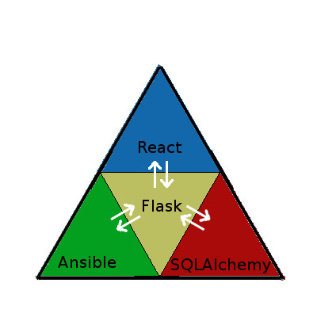

.. title: DJBot a la batuta
:css: css/tesis.css

----

:class: centered

DJBot a la batuta:
==================

Salas de computadoras
---------------------

hechas orquesta
---------------

.. image:: ./img/unlp_escudo.png

.. note::

   - Al jurado por la buena predisposicion para coordinar esta exposición.
   - A mis directores por la colaboración
   - A mi compañera por su paciencia y dedicacion
   - A mis padres por regalarme la vida
   - A mis familiares y amigos por aguantar mis locuras
   - A todos los que comparten enseñanzas positivas
   
   1m
	   
----

Agenda
======

* `Historia académica`_
* `Perfiles técnicos`_
* DevOps_
* Virtualización_
* Orquestación_
* DJBot_

.. _`Historia académica`: ./index.html#/step-3
.. _`Perfiles técnicos`: ./index.html#/step-4
.. _DevOps: ./index.html#/step-5
.. _Virtualización: ./index.html#/step-6
.. _Orquestación: ./index.html#/step-7
.. _DJBot: ./index.html#/step-8

.. note::
   - Historia
   - Perfiles tecnicos
   - DevOps
   - Virtualizacion
   - Orquestación
   - DJBot
   
----

Historia académica
==================

- Ingresé a estudiar en el año 2006
- Trabajé en el proyecto Lihuen de 2008 a 2014

.. note::
   - Ingresante 2006
   - Linti (2008-2014)
   - Base de este trabajo
   - Responsabilidades dentro de Lihuen

   1m
     
----

Perfiles técnicos
=================

* Desarrollador de software
* Administrador de sistemas

.. note::
   - Programador implementa funcionalidad
   - Desarrollador diseña la estructura de clases 
   - Programadores y desarrolladores por igual

   1/2 min

  
----

:data-rotate-y: 90
:data-y: r10
:data-x: r0

Desarrollador de software
=========================

- Trabajo en equipo
- Diseño
- Pruebas
- Mantenimiento

.. note::
   - 

   1 min

  
----

:data-y: r1600

Administrador de sistemas
=========================

- Objetivo:

  * Garantizar el tiempo de actividad

  * Rendimiento

  * Uso de recursos

  * Seguridad

- Conocimiento de:
  
  * Redes
    
  * Sistemas operativos

.. note::
   - No existe un solo camino para ser un administrador de sistemas
   - Perfil 

   1 min

    
----

:data-rotate-y: 0
:data-y: r-1610
:data-x: r1600
   
*DevOps*
========

.. image:: img/devops.png
   :width: 800
   :height: 600
   :target: http://blog.rackspace.com/what-do-chef-and-devops-mean-to-rackspace-find-out-at-chefconf/
	      

.. note::
   - Contraccion de Development y Operations
   - Comunidad que surgio en 2008

   6 min

----

:data-y: r0
:data-x: r1600

Virtualización
==============

Virtualización es la creación, a través de software, de una **versión virtual de algún recurso tecnológico**, como puede ser una plataforma de hardware, un sistema operativo, un dispositivo de almacenamiento u otros recursos de red.

.. note::
   - Reducción de los costes de espacio y consumo
   - Aislamiento
   - Administración global centralizada y simplificada
   - Balanceo dinámico de máquinas virtuales entre los servidores físicos que componen el pool de recursos
   - Green IT virtualizacion 35%
   - Desconectar en periodo de inactividad 25%
   
   4 min

----

Contenedores
============

- LXC_
- Docker_
- CoreOs_  
- Kubernetes_
- Panamax_

.. _LXC: https://linuxcontainers.org/
.. _Docker: https://www.docker.com/
.. _CoreOS: https://coreos.com/
.. _Kubernetes: http://kubernetes.io/
.. _Panamax: http://panamax.io/

  
.. note::
   - LXC 2008
   - Docker 2014
   - Microservicios     
   - CoreOS
     
     7 min

----

Orquestación
============

Por “orquestar” se entiende ‘la organización de distintos instrumentos y la definición de la interacción entre ellos, de manera que vibren al unísono’.

- Ansible_
- Cheff_
- Puppet_
- Otter_

.. _Ansible: https://www.ansible.com/
.. _Cheff: https://www.chef.io/chef/
.. _Puppet: https://puppet.com/
.. _Otter: http://inedo.com/otter

.. note::
   - idempotente
     
   5 min

----

:data-x: r0
:data-y: r1600	 
:class: djbot centered

DJBot
=====
	

Aplicación web, de uso libre, basada en Ansible, para “orquestar” salas de computadoras.
	   
.. note::
   * Facil instalacion
   * Facil uso
     
   5 min

----

:class: centered

Composición
===========

   
.. note::
   - integracion de componentes
   - Ansible
   - SQLAlchemy
   - Flask
   - React

   5 min

----

Métodos de conexión
===================

- HTTPS
- SSH

  * Redireccionamiento de puertos

- Consideración a futuro

  * `Autenticación descentralizada mediante criptografía asimétrica`_, propuesta por Benencia, Raúl 
    

.. _`Autenticación descentralizada mediante criptografía asimétrica`: http://sedici.unlp.edu.ar/handle/10915/47080
    
.. note::
   

   
   5 min

----

Utilización
===========

.. note::
   10 min

----

:data-x: r-2500
:data-y: r-3000
:data-scale: 10
:data-rotate-z: 0
:data-rotate-x: 0
:data-rotate-y: 0
:data-z: 0

¿Preguntas?
===========

.. note::
   duracion total: 50m
