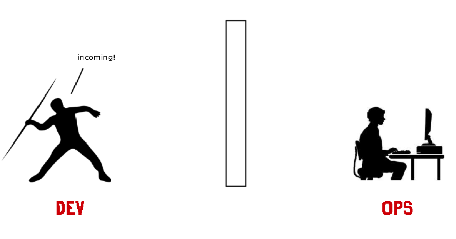

.. title: DJBot a la batuta
:css: css/tesis.css

----

:class: centered

DJBot a la batuta
=================

Salas de computadoras hechas orquesta
-------------------------------------

.. image:: ./img/unlp_escudo.png

.. note::

   - Agradecer al jurado por posibilitar esta defensa de tesina.
   - A mis directores por la colaboración
   - A mi compañera por su paciencia y dedicacion
   - A mis padres por concederme vida
   - A todos los que comparten enseñanzas positivas
   
   1m
	   
----

Agenda
======

* `Historia academica`_
* `Perfiles tecnicos`_
* DevOps_
* Virtualización_
* Orquestación_
* DJBot_

.. _`Historia academica`: ./index.html#/step-3
.. _`Perfiles tecnicos`: ./index.html#/step-4
.. _DevOps: ./index.html#/step-5
.. _Virtualización: ./index.html#/step-6
.. _Orquestación: ./index.html#/step-7
.. _DJBot: ./index.html#/step-8

.. note::
   - Historia
   - Perfiles tecnicos
   - DevOps
   - Virtualizacion
   - Orquestación
   - DJBot
   
----

Historia academica
==================

- Ingrese en 2006
- Trabaje en el proyecto Lihuen de 2008 a 2014

.. note::
   - Ingresante 2006
   - Linti (2008-2014)
   - Responsabilidades dentro de Lihuen

   1m
     
----

Perfiles tecnicos
=================

* Administrador de sistemas
* Desarrollador de software

.. note::
   - ¨Se cayo el sistema¨

   3 min

----

:data-rotate-y: 90
:data-y: r10
:data-x: r0

Desarrollador de software
=========================

- Especialista
  
----

:data-y: r1600

Administrador de sistemas
=========================

- Conocimiento de redes
- Conocimiento de sistemas operativos

----

:data-rotate-y: 0
:data-y: r0
:data-x: r0
   
*DevOps*
========

	      

.. note::
   - Contraccion de Development y Operations

   6 min

----

:data-x: r1600

Virtualización
==============

Virtualización es la creación a través de software de una versión virtual de algún recurso tecnológico, como puede ser una plataforma de hardware, un sistema operativo, un dispositivo de almacenamiento u otros recursos de red.

----

Contenedores
============

- LXC_
- Docker_
- CoreOs_  
- Kubernetes_
- Panamax_

.. _LXC: https://linuxcontainers.org/
.. _Docker: https://www.docker.com/
.. _CoreOS: https://coreos.com/
.. _Kubernetes: http://kubernetes.io/
.. _Panamax: http://panamax.io/

  
.. note::
   - LXC 2008
   - Docker 2014
   - CoreOS
     
     10 min

----

Orquestación
============

- Ansible_
- Cheff_
- Puppet_
- Otter_

.. _Ansible: https://www.ansible.com/
.. _Cheff: https://www.chef.io/chef/
.. _Puppet: https://puppet.com/
.. _Otter: http://inedo.com/otter

.. note::
   
   5 min

----

:data-z: r1000
:data-r: r0
:class: djbot
	 
	 
DJBot
=====

.. image:: ./img/batuta.gif
   :target: http://yohagomusica.blogspot.com.ar/2008/09/orquesta-batuta.html

Objetivo en desarrollo

.. note::
   Facil instalacion
   Facil uso
   5 min

----

Composición
===========

Ansible

SQLAlchemy

Flask

React

.. note::
   - integracion de componentes

   5 min

----

Seguridad
=========

.. note::
   5 min

----

Utilización
===========

.. note::
   10 min

----

:data-x: 0
:data-y: r1500
:data-scale: 20
:data-rotate-z: 0
:data-rotate-x: 0
:data-rotate-y: 0
:data-z: 0

¿Preguntas?
===========

.. note::
   duracion total: 50m
